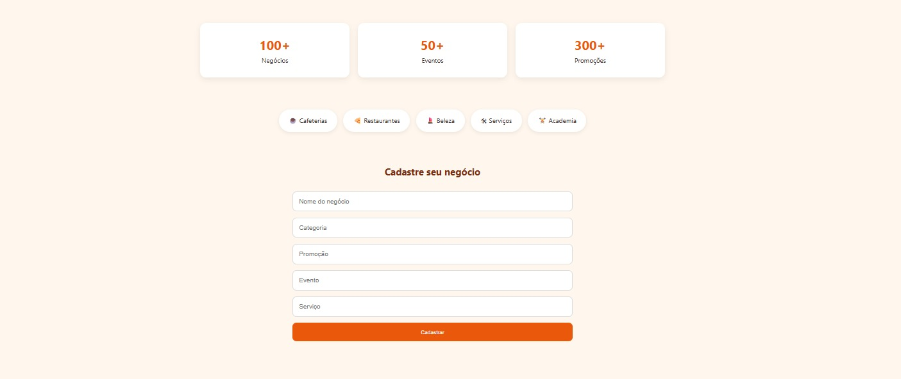
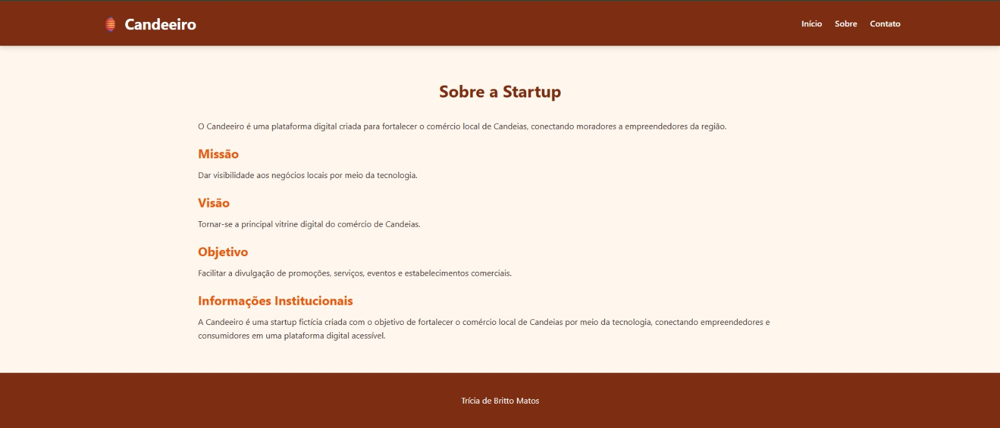
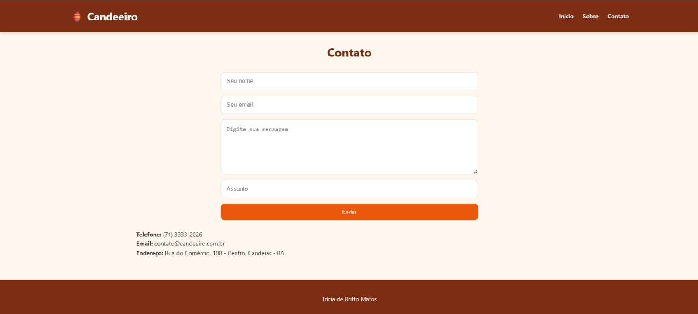
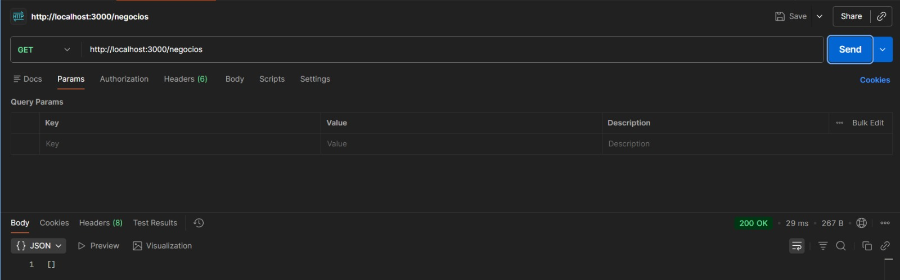
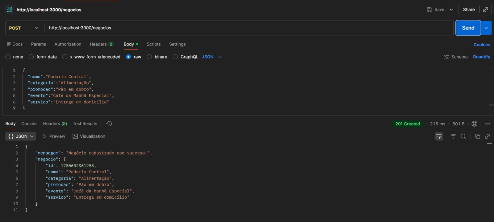

# 🏮 Candeeiro

## Iluminando oportunidades locais

---

## 📌 Sobre o Projeto

A Candeeiro é uma startup criada com o objetivo de fortalecer o comércio local da cidade de Candeias, conectando moradores e empreendedores por meio de uma plataforma digital moderna, intuitiva e acessível.

A plataforma permite divulgar negócios, promoções, eventos e serviços da região, facilitando a comunicação entre comerciantes e consumidores.

Este projeto foi desenvolvido como atividade prática da disciplina de Desenvolvimento de APIs, utilizando integração completa entre Frontend e Backend através de uma API REST.

---

## 🎯 Objetivo da Plataforma

Desenvolver uma solução digital que permita:

* Cadastro de negócios locais;
* Divulgação de serviços;
* Publicação de promoções;
* Compartilhamento de eventos;
* Exibição dinâmica das informações cadastradas;
* Integração entre frontend e backend utilizando API REST.

---

## 🚀 Funcionalidades

### Frontend

✔ Página Inicial (Index)

✔ Página Sobre

✔ Página Contato

✔ Navbar funcional

✔ Formulário para cadastro de negócios

✔ Listagem dinâmica dos dados cadastrados

✔ Atualização sem recarregamento da página

✔ Layout responsivo

✔ Identidade visual personalizada

---

### Backend

✔ Servidor Node.js

✔ Framework Express

✔ Rota GET

✔ Rota POST

✔ Respostas em JSON

✔ Organização em pastas

✔ Integração com frontend

---

## 🛠 Tecnologias Utilizadas

### Frontend

* HTML5
* CSS3
* JavaScript
* Fetch API

### Backend

* Node.js
* Express.js

### Controle de Versão

* Git
* GitHub

---

## 🎨 Identidade Visual

### Nome da Startup

Candeeiro

### Slogan

"Iluminando oportunidades locais"

### Conceito da Marca

A marca representa a luz que guia moradores e empreendedores até novas oportunidades de negócio dentro da cidade de Candeias.

### Cores Utilizadas

| Cor         | Código  |
| ----------- | ------- |
| Laranja     | #FF8C42 |
| Azul Escuro | #1E3A5F |
| Branco      | #FFFFFF |
| Cinza Claro | #F4F4F4 |

---

## 📂 Estrutura do Projeto

```text
projeto/
│
├── backend/
│   ├── controllers/
│   ├── routes/
│   ├── data/
│   ├── app.js
│   └── server.js
│
├── frontend/
│   ├── assets/
│   │   └── logo.png
│   │
│   ├── css/
│   │   └── style.css
│   │
│   ├── js/
│   │   └── script.js
│   │
│   ├── index.html
│   ├── sobre.html
│   └── contato.html
│
└── README.md
```

---

## 🔗 Rotas da API

### Buscar Negócios

```http
GET /negocios
```

Resposta:

```json
[
  {
    "id": 1,
    "nome": "Mercadinho Central",
    "categoria": "Comércio",
    "descricao": "Produtos alimentícios"
  }
]
```

---

### Cadastrar Negócio

```http
POST /negocios
```

Body:

```json
{
  "nome": "Padaria Pão Quente",
  "categoria": "Alimentação",
  "descricao": "Pães e bolos artesanais"
}
```

Resposta:

```json
{
  "mensagem": "Negócio cadastrado com sucesso"
}
```

---

## 🖥 Telas da Aplicação

### Página Inicial

Inserir print da página inicial.



---

### Página Sobre

Inserir print da página sobre.



---

### Página Contato

Inserir print da página contato.



---

## 📬 Testes da API

### Teste GET no Postman



---

### Teste POST no Postman



---

## 👥 Integrantes da Equipe

* Trícia de Britto Matos

(Adicionar os demais integrantes, caso existam)

---

## 📚 Disciplina

Desenvolvimento de APIs

---

## 📅 Ano

2026

---

## 📍 Cidade

Candeias - Bahia

---

## 📄 Licença

Projeto desenvolvido exclusivamente para fins acadêmicos.
=======
